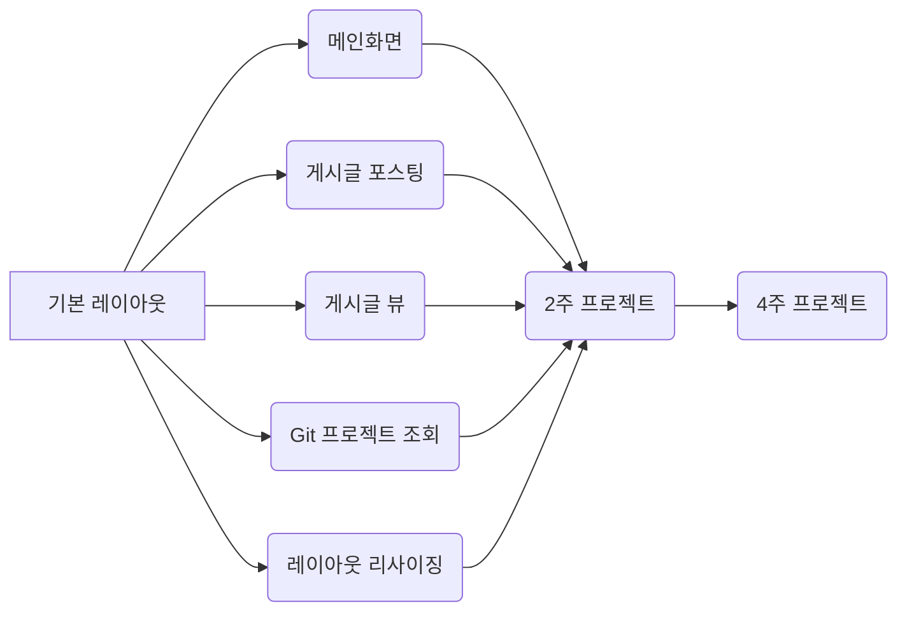

# README

>강사님 자료공유 git
>
>https://lab.ssafy.com/fusanova/firstpjt

## 프로젝트 개요

 본 프로젝트는 Vue.js 및 다양한 API를 이용해 개인화된 SW 개발 비서를 구현하는 것을 목표로 합니다.

 Vue.js를 활용해 반응형 웹 UI를 제작하고 그 과정을 통해 스켈레톤 프로젝트 코드를 익히는 것을 목표로 합니다.

 Open API를 활용한 SPA를 제작합니다.

 API를 연동해 다양한 정보를 수집해 보여주고 Firebase 백엔드를 연동해 자신만의 sw 개발 비서를 완성합니다.

## 프로젝트 목표

1. 기본 HTML/CSS/ES6에 대한 이해
2. 웹 프로젝트의 구성과 필요 기능 명세서 작성에 대한 이해
3. 외부 프레임워크와 Open API 활용
4.  SPA(Single Page Application)의 구조 이해
5. 반흥형 웹 페이지의 제작

## 스켈레톤 프로젝트

- 시작하기 전

    1. JIRA task 정리
2. 개발 환경 구성
       - node.js 설치
       - 현재 프로젝트 베이스가 있는 곳에서 npm설치
       - Atom 설치
       - Atom Vue.js 플러그인 설치
- Base 프로젝트의 구조

## 기능 명세

## 기능 구현

### Req. 1-14 코드 레벨 네비게이션 영역을 Header 컴포넌트로 분리

- Header / Footer component로 분리

### Req. 1-2 Header 영역에 블로그 제목 노출 구현

- App.vue에 Header/Footer components로 불러와서 모든 페이지에 노출되도록 구현

### Req. 1-1 Header, Footer 구현

- 네비게이션 바 역할을 하는 헤더와 사이트의 메타 정보가 노출되는 푸터를 구현합니다.

### Req. 1-3 스크롤 시 헤더가 같이 움직이도록 구현

### Req. 1-4 메인 이미지 영역이 새로고침시 마다 변경 되도록 구현

- unplash random link(특정 collection 사진 랜덤 노출) 사용하여 랜덤 이미지를 구현합니다.

  

### Req. 1-11 사이드 바의 메뉴(포스트, 포트폴리오, 로그인)을 클릭 시, 각 페이지로 이동 구현

### Req. 1-5 반응형 웹 사이트 구현

1. 모바일 사이즈에서 Home 화면의 About Me 이미지가 미노출되어야 합니다.
2. 모바일 사이즈에서 이미지 영역을 화면 사이즈로 조절합니다.
3. 모바일 사이즈에서 Home 화면의 About Me 텍스트 가운데 정렬이 되어야 합니다.
4. 가로 사이즈에 따라 텍스트 사이즈가 자동 조절 되도록 합니다.

### Req. 1-6 반응형 웹 사이트 구현(포트폴리오)

1. 모바일 사이즈에서 4행 1열 노출로 변경합니다.
2. 태블릿 사이즈에서 2행 2열 노출로 변경합니다.

### Req. 1-10 모바일 사이즈에서 3단 바 네비게이션 아이콘 구현

- 메뉴가 있는 사이드 바 노출, 이 때, 메뉴는 포스트, 포트폴리오, 로그인

### Req. 1-7 Portfolio 클릭시 페이지 이동을 구현

### Req. 1-13 favicon 변경 구현

### Req. 1-12 자신의 블로그 정보 커스터마이즈

1. 이미지 배너의 텍스트를 자신의 슬로건으로 변경합니다.
2. About Me를 본인의 자기소개 및 사진으로 변경합니다.

### Req. 1-17 페이지 스크롤 시 페이지 최상단으로 이동 버튼 추가 구현

- 해당 버튼은 최상단에서 미노출되도록 설정합니다.

### Req. 1-8 포트폴리오 리스트 페이지로 디테일 연결

### Req. 1-16 git 레포지토리 이름이 개행되지 않도록 설정

### Req. 1-15 포트폴리오, 포스트 리스트에서 타이틀은 한 줄, 설명은 3,4줄 표시로 구현

<script>

