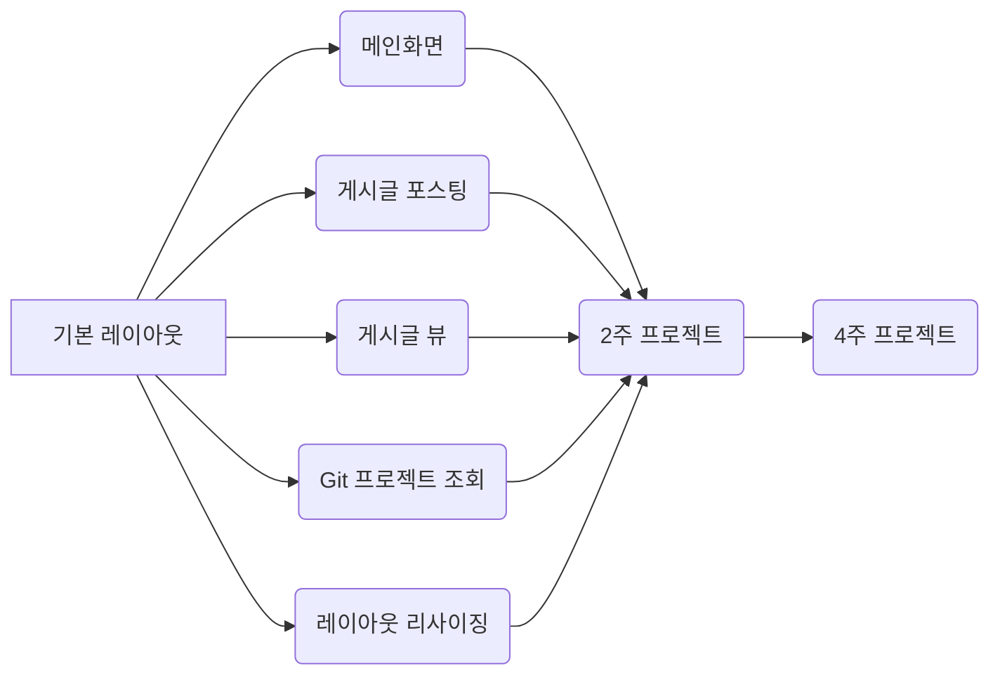

# README

>강사님 자료공유 git
>
>https://lab.ssafy.com/fusanova/firstpjt

## 프로젝트 개요

 본 프로젝트는 Vue.js 및 다양한 API를 이용해 개인화된 SW 개발 비서를 구현하는 것을 목표로 합니다.

 Vue.js를 활용해 반응형 웹 UI를 제작하고 그 과정을 통해 스켈레톤 프로젝트 코드를 익히는 것을 목표로 합니다.

 Open API를 활용한 SPA를 제작합니다.

 API를 연동해 다양한 정보를 수집해 보여주고 Firebase 백엔드를 연동해 자신만의 sw 개발 비서를 완성합니다.

## 프로젝트 목표

1. 기본 HTML/CSS/ES6에 대한 이해
2. 웹 프로젝트의 구성과 필요 기능 명세서 작성에 대한 이해
3. 외부 프레임워크와 Open API 활용
4.  SPA(Single Page Application)의 구조 이해
5. 반흥형 웹 페이지의 제작

## 스켈레톤 프로젝트

- 시작하기 전

    1. JIRA task 정리
2. 개발 환경 구성
       - node.js 설치
       - 현재 프로젝트 베이스가 있는 곳에서 npm설치
       - Atom 설치
       - Atom Vue.js 플러그인 설치
- Base 프로젝트의 구조

## 기능 명세

